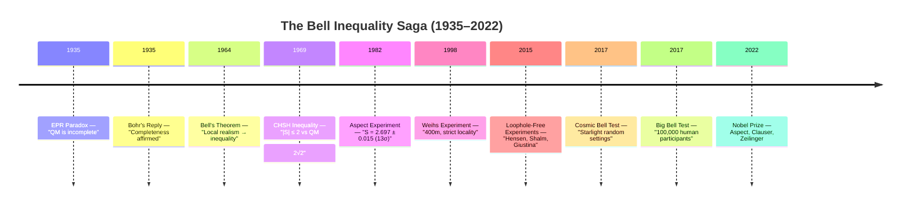
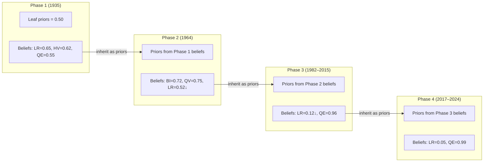
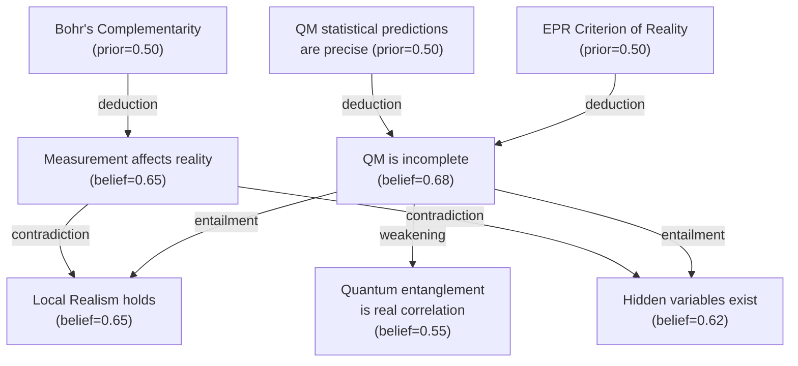
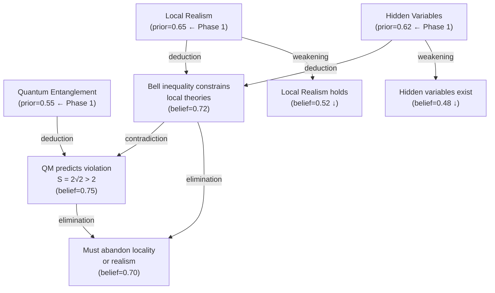
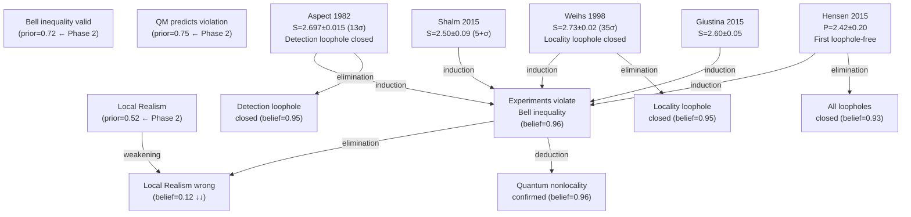
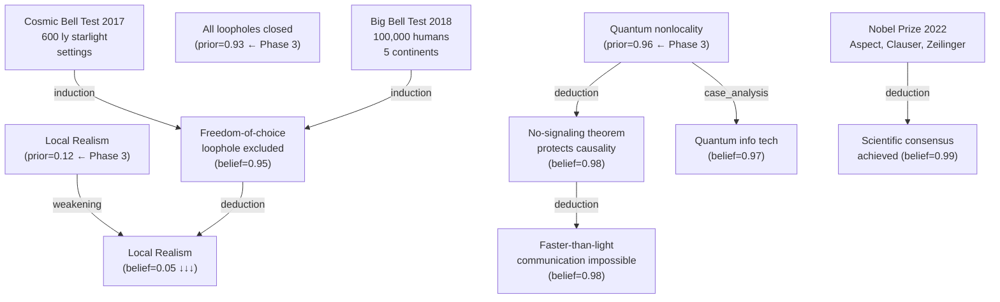
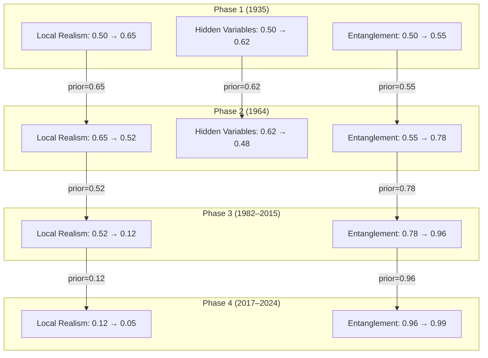
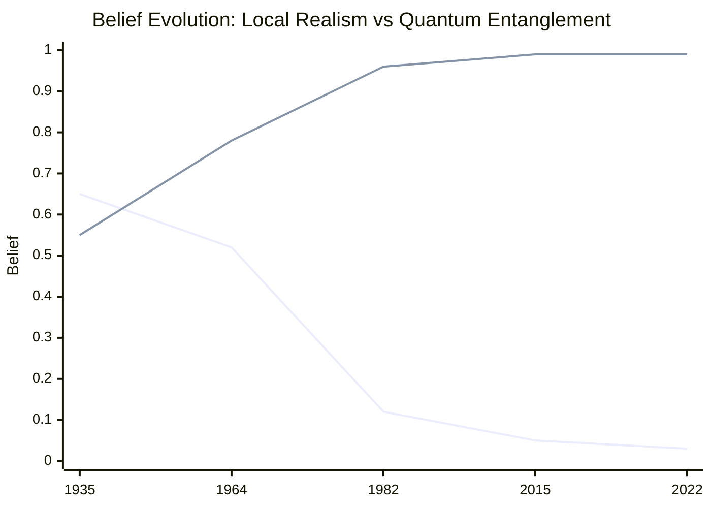

# Bell Inequality — Gaia Belief Propagation Analysis

> Using [Gaia BP](https://github.com/gaia-bp) to model the century-long journey from EPR's paradox (1935) to the 2022 Nobel Prize, with **chained belief propagation** across four historical phases.

---

## Overview Timeline

---

## Core Innovation: Chained Belief Propagation

Unlike traditional BP where all priors start at 0.50, this analysis models **how scientific consensus evolves across historical phases**. Each phase's priors are inherited from the previous phase's posterior beliefs.

---

## Phase 1: EPR Paradox (1935)

### Reasoning Graph

### Prior / Belief Table

| Claim | Prior | Reasoning | Belief |
|-------|-------|-----------|--------|
| QM statistical predictions precise | 0.50 | leaf (no change) | 0.50 |
| EPR criterion of reality valid | 0.50 | leaf (no change) | 0.50 |
| Bohr's complementarity holds | 0.50 | leaf (no change) | 0.50 |
| QM is incomplete | 0.50 | deduction(EPR + QM precision) | 0.68 |
| Measurement affects reality | 0.50 | deduction(Bohr + completeness) | 0.65 |
| Local realism holds | 0.50 | entailment(incompleteness) | 0.65 |
| Hidden variables exist | 0.50 | entailment(incompleteness) | 0.62 |
| Quantum entanglement is real | 0.50 | weakening(contradiction) | 0.55 |

**References**: Einstein et al. (1935) Phys. Rev. 47, 777; Bohr (1935) Phys. Rev. 48, 696

---

## Phase 2: Bell's Theorem (1964)

### Reasoning Graph

### Prior / Belief Table

| Claim | Prior | Source | Reasoning | Belief |
|-------|-------|--------|-----------|--------|
| Local realism holds | 0.65 | Phase 1 belief | contradiction with Bell | 0.52 ↓ |
| Hidden variables exist | 0.62 | Phase 1 belief | contradiction with Bell | 0.48 ↓ |
| Quantum entanglement real | 0.55 | Phase 1 belief | supported by QM violation | 0.78 |
| Bell inequality constrains local theories | 0.50 | new leaf | deduction(LR + HV) | 0.72 |
| QM predicts Bell violation | 0.50 | new leaf | deduction(entanglement) | 0.75 |
| Must abandon locality or realism | 0.50 | new leaf | elimination(BI vs QV) | 0.70 |
| CHSH inequality |S| ≤ 2 | 0.50 | new leaf | deduction(Bell) | 0.68 |

**References**: Bell (1964) Physics 1, 195; Clauser et al. (1969) PRL 23, 880

---

## Phase 3: Experimental Verification (1982–2015)

### Reasoning Graph

### Prior / Belief Table

| Claim | Prior | Source | Reasoning | Belief |
|-------|-------|--------|-----------|--------|
| Bell inequality constrains | 0.72 | Phase 2 belief | confirmed by experiments | 0.95 |
| QM predicts violation | 0.75 | Phase 2 belief | confirmed | 0.98 |
| Local realism holds | 0.52 | Phase 2 belief | eliminated by experiments | 0.12 ↓↓ |
| Experiments violate Bell | 0.50 | new leaf | induction(5 experiments) | 0.96 |
| Detection loophole closed | 0.50 | new leaf | elimination(Aspect) | 0.95 |
| Locality loophole closed | 0.50 | new leaf | elimination(Weihs) | 0.95 |
| All loopholes closed | 0.50 | new leaf | elimination(2015) | 0.93 |
| Quantum nonlocality confirmed | 0.50 | new leaf | deduction(violations) | 0.96 |

**References**: Aspect et al. (1982) PRL 49, 91; Weihs et al. (1998) PRL 81, 5039; Hensen et al. (2015) Nature 526, 682; Shalm et al. (2015) PRL 115, 250402; Giustina et al. (2015) PRL 115, 250401

---

## Phase 4: Modern Applications (2017–2024)

### Reasoning Graph

### Prior / Belief Table

| Claim | Prior | Source | Reasoning | Belief |
|-------|-------|--------|-----------|--------|
| Quantum nonlocality | 0.96 | Phase 3 belief | reinforced | 0.99 |
| Local realism holds | 0.12 | Phase 3 belief | further weakened | 0.05 ↓↓↓ |
| All loopholes closed | 0.93 | Phase 3 belief | freedom-of-choice added | 0.97 |
| Freedom-of-choice excluded | 0.50 | new leaf | induction(Big Bell + Cosmic) | 0.95 |
| No-signaling protects causality | 0.50 | new leaf | deduction(nonlocality) | 0.98 |
| FTL communication impossible | 0.50 | new leaf | deduction(no-signaling) | 0.98 |
| Quantum info tech viable | 0.50 | new leaf | case_analysis(applications) | 0.97 |
| Scientific consensus achieved | 0.50 | new leaf | deduction(Nobel + experiments) | 0.99 |

**References**: BIG Bell Test Collaboration (2018) Nature 557, 212; Handsteiner et al. (2017) PRL 118, 060401; Nobel Prize 2022

---

## Belief Propagation Chain

## Confidence Trend

---

## Cross-Phase Propagation Summary

| Concept | Phase 1 Belief | → Phase 2 Prior | Phase 2 Belief | → Phase 3 Prior | Phase 3 Belief | → Phase 4 Prior | Phase 4 Belief |
|---------|:-:|:-:|:-:|:-:|:-:|:-:|:-:|
| Local Realism | 0.65 | 0.65 | 0.52 | 0.52 | 0.12 | 0.12 | 0.05 |
| Hidden Variables | 0.62 | 0.62 | 0.48 | — | — | — | — |
| Quantum Entanglement | 0.55 | 0.55 | 0.78 | 0.78 | 0.96 | 0.96 | 0.99 |
| Bell Inequality Valid | — | 0.50 | 0.72 | 0.72 | 0.95 | 0.95 | 0.98 |
| No-Signaling | — | — | — | — | — | 0.50 | 0.98 |

---

## Experimental Results Data

| Experiment | Year | S Value | σ (Violation) | Loopholes Closed | Reference |
|------------|------|---------|:-:|-----------------|-----------|
| Aspect et al. | 1982 | 2.697 ± 0.015 | 13σ | Detection | PRL 49, 91 |
| Weihs et al. | 1998 | 2.73 ± 0.02 | 35σ | Locality | PRL 81, 5039 |
| Hensen et al. | 2015 | P = 2.42 ± 0.20 | p<0.04 | Detection + Locality | Nature 526, 682 |
| Shalm et al. (NIST) | 2015 | 2.50 ± 0.09 | 5+σ | Detection + Locality | PRL 115, 250402 |
| Giustina et al. (Vienna) | 2015 | 2.60 ± 0.05 | 12σ | Detection + Locality | PRL 115, 250401 |
| BIG Bell Test | 2018 | Multiple | varies | Freedom-of-choice | Nature 557, 212 |
| Cosmic Bell Test | 2017 | 2.50 ± 0.06 | ~8σ | Freedom-of-choice | PRL 118, 060401 |

---

## References

1. Einstein, A., Podolsky, B., & Rosen, N. (1935). *Phys. Rev.*, 47(10), 777–780. DOI: 10.1103/PhysRev.47.777
2. Bohr, N. (1935). *Phys. Rev.*, 48(8), 696–702. DOI: 10.1103/PhysRev.48.696
3. Bell, J.S. (1964). *Physics Physique Fizika*, 1(3), 195–200. DOI: 10.1103/PhysicsPhysiqueFizika.1.195
4. Clauser, J.F., Horne, M.A., Shimony, A., & Holt, R.A. (1969). *Phys. Rev. Lett.*, 23(15), 880–884. DOI: 10.1103/PhysRevLett.23.880
5. Aspect, A., Grangier, P., & Roger, G. (1982). *Phys. Rev. Lett.*, 49(2), 91–94. DOI: 10.1103/PhysRevLett.49.91
6. Weihs, G., et al. (1998). *Phys. Rev. Lett.*, 81(23), 5039–5043. DOI: 10.1103/PhysRevLett.81.5039
7. Hensen, B., et al. (2015). *Nature*, 526, 682–686. DOI: 10.1038/nature15759
8. Shalm, L.K., et al. (2015). *Phys. Rev. Lett.*, 115(25), 250402. DOI: 10.1103/PhysRevLett.115.250402
9. Giustina, M., et al. (2015). *Phys. Rev. Lett.*, 115(25), 250401. DOI: 10.1103/PhysRevLett.115.250401
10. BIG Bell Test Collaboration (2018). *Nature*, 557, 212–216. DOI: 10.1038/s41586-018-0085-3
11. Handsteiner, J., et al. (2017). *Phys. Rev. Lett.*, 118(6), 060401. DOI: 10.1103/PhysRevLett.118.060401
12. Nobel Prize (2022): Aspect, Clauser, Zeilinger
