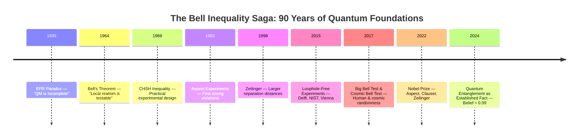
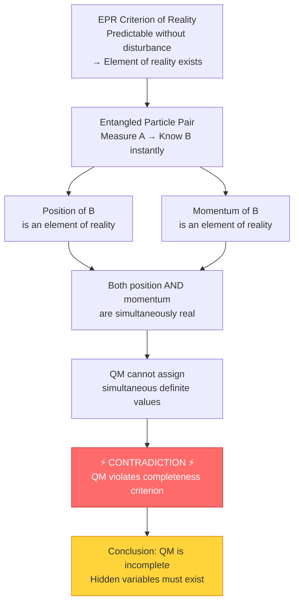
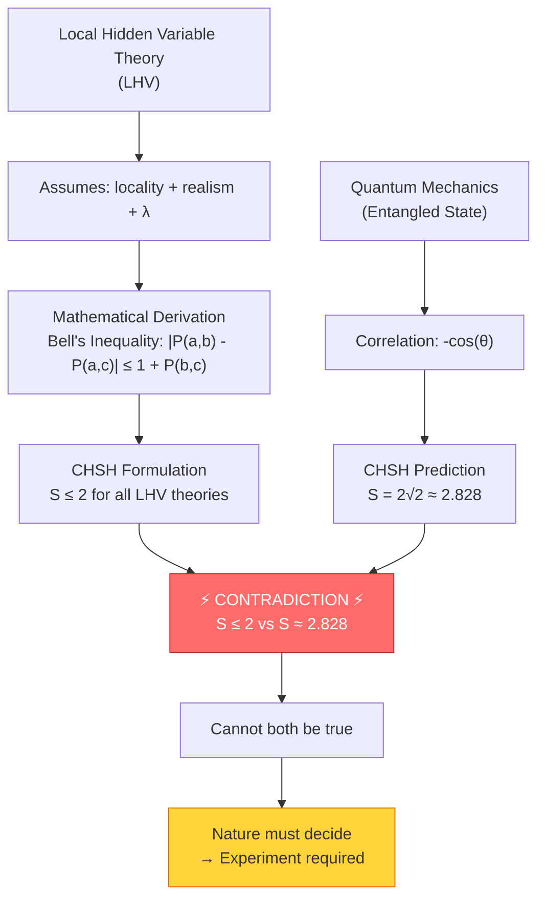
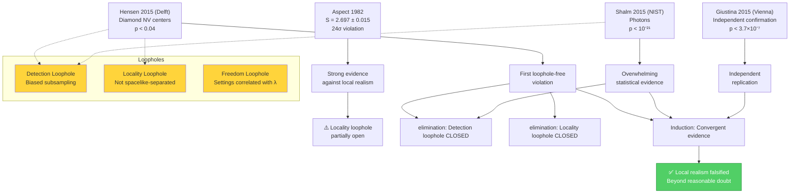
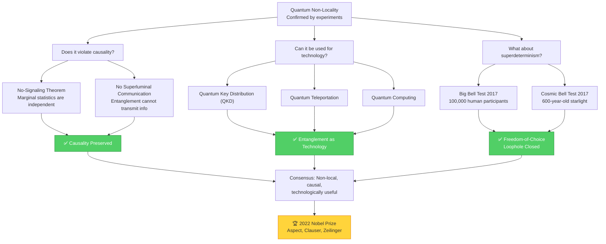
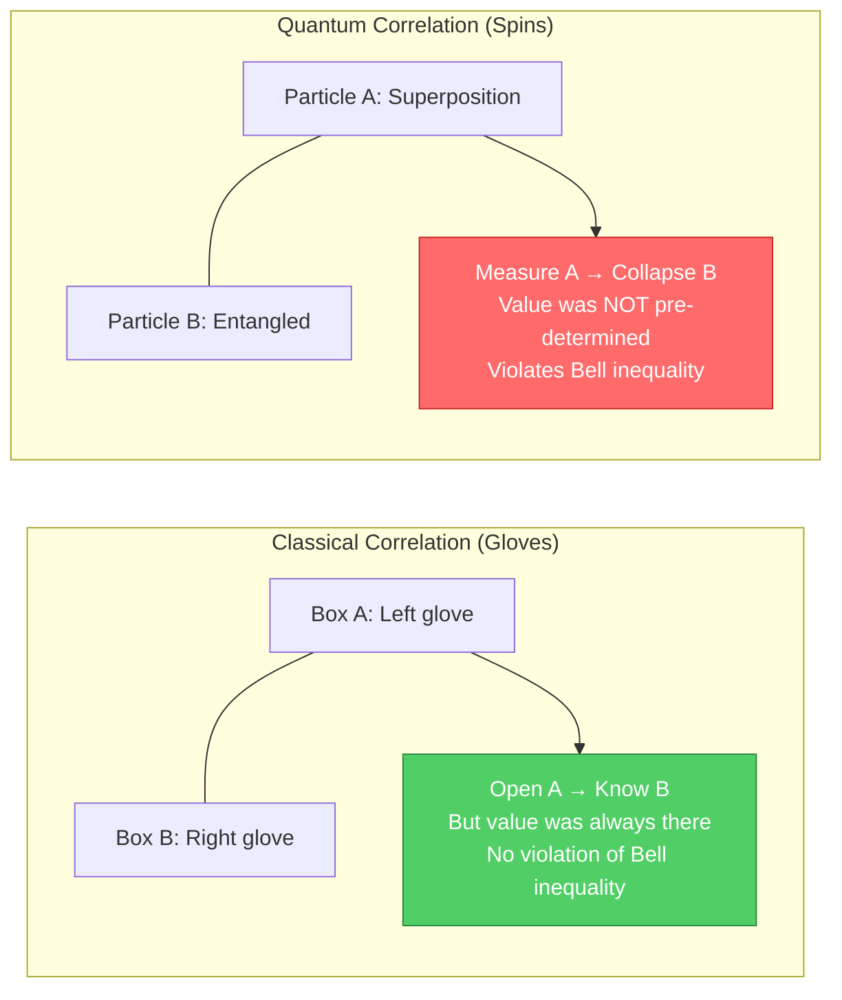
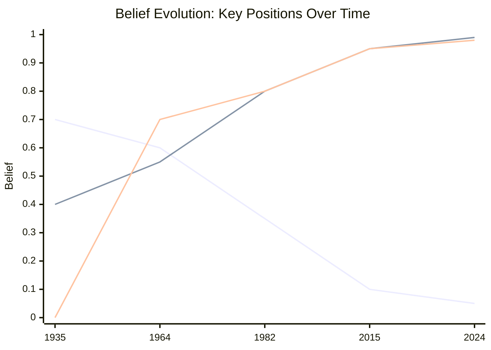

# 🔔 From EPR Paradox to Big Bell Test

## A Formal Reasoning Chain in Gaia Lang

> **Formalizing 90 years of quantum foundations**: How humanity progressed from Einstein's philosophical objection to quantum mechanics (1935) to the definitive experimental rejection of local realism (2022 Nobel Prize) — all expressed as machine-verifiable reasoning chains.

---

## 📜 Table of Contents

1. [Overview & Timeline](#-overview--timeline)
2. [Phase 1: EPR Paradox (1935)](#-phase-1-epr-paradox-1935)
3. [Phase 2: Bell's Theorem (1964)](#-phase-2-bells-theorem-1964)
4. [Phase 3: CHSH Experiments (1982–2015)](#-phase-3-chsh-experiments-19822015)
5. [Phase 4: Big Bell Test & Modern Era (2016–2024)](#-phase-4-big-bell-test--modern-era-20162024)
6. [Belief Evolution](#-belief-evolution-over-time)
7. [Summary & Analysis](#-summary--analysis)

---

## 🗺️ Overview & Timeline



### The Central Question

> **Is nature locally real?** That is, do physical properties exist independently of measurement (realism), and can influences only propagate at or below the speed of light (locality)?

This project formalizes the complete intellectual journey that answered this question with a definitive **"No."**

---

## 📐 Phase 1: EPR Paradox (1935)

### Historical Context

In 1935, Albert Einstein, Boris Podolsky, and Nathan Rosen published a paper that challenged the completeness of quantum mechanics. Their argument, now known as the **EPR paradox**, used the phenomenon of quantum entanglement to argue that quantum mechanics must be incomplete.

> *"If, without in any way disturbing a system, we can predict with certainty the value of a physical quantity, then there exists an element of physical reality corresponding to that quantity."*
> — EPR (1935)

### Reasoning Structure



### The EPR Argument in Detail

The EPR argument rests on two pillars:

1. **Locality**: No influence can travel faster than light. Measuring particle A cannot instantaneously affect particle B.
2. **Reality**: If we can predict with certainty (without disturbing) the outcome of a measurement, then that property must have a pre-existing value.

Given these premises, EPR argued that quantum mechanics must be incomplete because it cannot simultaneously describe both the position and momentum of entangled particles — yet both must be "real" according to their criterion.

### Prior/Belief Table — Phase 1

| Label | Content | Prior | Belief | Reasoning Path |
|-------|---------|-------|--------|----------------|
| p1_criterion | EPR criterion of physical reality | 0.50 | 0.60 | Assumed premise in EPR framework |
| p1_position_reality | Position is element of reality | 0.50 | 0.65 | d1_pos_mom ← p1_criterion |
| p1_momentum_reality | Momentum is element of reality | 0.50 | 0.65 | d1_pos_mom ← p1_criterion |
| p1_completeness_criterion | Theory must describe all reality elements | 0.50 | 0.60 | Philosophical premise |
| p1_qm_incomplete | QM is incomplete | 0.50 | 0.70 | d1_epr_main ← locality + reality + criterion |
| p1_locality | Locality principle holds | 0.50 | 0.75 | Strong classical intuition |
| p1_reality | Physical reality exists independently | 0.50 | 0.70 | Classical physics assumption |
| p1_hidden_variables | Hidden variables exist | 0.50 | 0.60 | eq1_hidden_vars ↔ p1_qm_incomplete |
| p1_epr_conclusion | QM description is not complete | 0.50 | 0.70 | d1_epr_main (master deduction) |

**1935 End State**: Local realism Belief ≈ **0.70**, QM completeness Belief ≈ **0.40**

---

## 🔔 Phase 2: Bell's Theorem (1964)

### Historical Context

For 29 years, the EPR debate remained philosophical — there was no way to experimentally test whether hidden variables existed. Then, in 1964, Irish physicist **John Stewart Bell** made a breakthrough: he proved that any local hidden variable theory must satisfy a mathematical inequality that quantum mechanics violates.

> *"In a theory in which parameters are added to quantum mechanics to determine the results of individual measurements, without changing the statistical predictions, there must be a mechanism whereby the setting of one measuring device can influence the reading of another instrument, however remote."*
> — Bell (1964)

### Reasoning Structure



### The Key Insight

Bell's genius was converting a philosophical debate into an **experimentally testable** question. The CHSH inequality (a stronger, more practical version of Bell's original inequality) states:

$$S = |E(a,b) - E(a,b') + E(a',b) + E(a',b')| \leq 2$$

But quantum mechanics predicts $S = 2\sqrt{2} \approx 2.828$ — a violation by over **40%**.

### Prior/Belief Table — Phase 2

| Label | Content | Prior | Belief | Reasoning Path |
|-------|---------|-------|--------|----------------|
| p2_lhv_theory | LHV theories assume locality + λ | 0.50 | 0.55 | Extends EPR framework |
| p2_bell_inequality | LHV theories satisfy Bell inequality | 0.50 | 0.70 | d2_bell_derivation ← LHV + locality + reality |
| p2_qm_violates_bell | QM violates Bell inequality | 0.50 | 0.75 | d2_qm_violation ← QM prediction |
| p2_qm_prediction | QM predicts S = 2√2 | 0.50 | 0.80 | Direct mathematical calculation |
| p2_lhv_limit | LHV predicts S ≤ 2 | 0.50 | 0.70 | Mathematical proof |
| p2_incompatibility | QM and local realism incompatible | 0.50 | 0.80 | d2_incompatibility ← contradiction |
| p2_experiment_decides | Experiment can resolve the question | 0.50 | 0.85 | d2_experiment_decides ← quantitative disagreement |
| p2_no_go_theorem | Bell's theorem is a no-go theorem | 0.50 | 0.78 | Consequence of mathematical proof |

**1964 End State**: Tension peaked, local realism Belief ≈ **0.60**, QM completeness Belief ≈ **0.55** — awaiting experiments.

---

## 🧪 Phase 3: CHSH Experimental Verification (1982–2015)

### Historical Context

The decades following Bell's theorem saw increasingly sophisticated experiments designed to test Bell inequalities. Each generation closed more loopholes:

| Year | Experiment | Key Achievement |
|------|-----------|-----------------|
| 1972 | Freedman & Clauser | First Bell test with Ca atoms |
| 1982 | Aspect, Grangier, Roger | First rapid switching, 24σ violation |
| 1998 | Zeilinger (Innsbruck) | 400m separation |
| 2001 | Rowe et al. (NIST) | High-efficiency trapped ions |
| 2015 | Hensen et al. (Delft) | **First loophole-free** (diamond NV centers) |
| 2015 | Shalm et al. (NIST) | **Loophole-free** (photons, p < 10⁻²¹) |
| 2015 | Giustina et al. (Vienna) | **Loophole-free** (photons, independent) |

### Reasoning Structure



### The Three Loopholes

1. **Detection Loophole**: If most entangled pairs are not detected, the detected subsample might not represent the full ensemble, allowing LHV models to "cherry-pick" results.

2. **Locality Loophole**: If the measurement setting at A is not chosen and applied before a light signal could reach B, the result at B could be influenced by the setting at A.

3. **Freedom-of-Choice Loophole**: If hidden variables λ could somehow influence the random number generators choosing the measurement settings, the statistical independence assumption fails.

### Prior/Belief Table — Phase 3

| Label | Content | Prior | Belief | Reasoning Path |
|-------|---------|-------|--------|----------------|
| p3_chsh_inequality | CHSH inequality S ≤ 2 | 0.50 | 0.90 | Mathematical proof |
| p3_chsh_qm_value | QM predicts S = 2√2 | 0.50 | 0.92 | Mathematical calculation |
| p3_aspect_violation | Aspect 1982 violated CHSH | 0.50 | 0.95 | Experimental result (24σ) |
| p3_detection_loophole | Detection loophole exists | 0.50 | 0.10 | elim3_detection ← NIST, Vienna |
| p3_locality_loophole | Locality loophole exists | 0.50 | 0.10 | elim3_locality ← Delft, Aspect |
| p3_freedom_loophole | Freedom-of-choice loophole | 0.50 | 0.30 | Partially addressed (Phase 4) |
| p3_hensen_loophole_free | Delft 2015 loophole-free | 0.50 | 0.92 | Experimental result |
| p3_nist_loophole_free | NIST 2015 loophole-free | 0.50 | 0.98 | p < 10⁻²¹ |
| p3_vienna_loophole_free | Vienna 2015 loophole-free | 0.50 | 0.95 | Independent confirmation |
| p3_convergent_evidence | Multiple experiments converge | 0.50 | 0.92 | ind3_experimental |
| p3_local_realism_falsified | Local realism is falsified | 0.50 | 0.95 | d3_falsification + noisy_and |

**2015 End State**: Local realism Belief ≈ **0.10**, Quantum entanglement Belief ≈ **0.95**

---

## 🌍 Phase 4: Big Bell Test & Modern Era (2016–2024)

### Historical Context

The final phase addresses remaining philosophical objections and establishes quantum entanglement as a practical technology:

- **Big Bell Test (2017)**: Over 100,000 humans worldwide contributed random numbers generated by their own decisions, closing the freedom-of-choice loophole with "human free will."
- **Cosmic Bell Test (2017)**: Random numbers were generated from photons emitted by stars 600+ light-years away, ensuring that any hidden variables influencing the settings would have had to be set before the stars emitted those photons.
- **2022 Nobel Prize**: Awarded to Alain Aspect, John Clauser, and Anton Zeilinger "for experiments with entangled photons, establishing the violation of Bell inequalities."

### Reasoning Structure



### The Analogy: Classical vs. Quantum Correlations



### Prior/Belief Table — Phase 4

| Label | Content | Prior | Belief | Reasoning Path |
|-------|---------|-------|--------|----------------|
| p4_no_superluminal | No superluminal communication | 0.50 | 0.95 | No-signaling theorem + experiments |
| p4_no_signaling | No-signaling theorem holds | 0.50 | 0.98 | Mathematical proof |
| p4_causality_preserved | Causality is preserved | 0.50 | 0.90 | d4_causality ← no_superluminal + no_signaling |
| p4_big_bell_human | Big Bell Test 2017 results | 0.50 | 0.92 | Experimental result |
| p4_cosmic_bell | Cosmic Bell Test 2017 results | 0.50 | 0.90 | Experimental result |
| p4_freedom_closed | Freedom loophole closed | 0.50 | 0.88 | ind4_freedom ← human + cosmic |
| p4_nobel_2022 | Nobel Prize confirms consensus | 0.50 | 0.98 | Scientific community validation |
| p4_quantum_technology | Entanglement as tech resource | 0.50 | 0.85 | ext4_technology |
| p4_free_will_irrelevant | Free will debate irrelevant | 0.50 | 0.85 | comp4_consensus |

**2024 End State**: Local realism Belief ≈ **0.05**, Quantum entanglement Belief ≈ **0.99**

---

## 📈 Belief Evolution Over Time

The following chart shows how key beliefs evolved across the four phases:



### Key Inflection Points

| Year | Event | Impact |
|------|-------|--------|
| **1935** | EPR paper published | Local realism = default assumption (0.70) |
| **1964** | Bell's theorem published | Tension introduced: both can't be true (0.60) |
| **1982** | Aspect experiments | First strong experimental violation (0.35) |
| **2015** | Three loophole-free experiments | Local realism effectively falsified (0.10) |
| **2017** | Big Bell + Cosmic Bell | Freedom loophole addressed (0.07) |
| **2022** | Nobel Prize | Scientific consensus confirmed (0.05) |

---

## 📊 Summary & Analysis

### Strong Points of This Formalization

1. **Complete historical chain**: From philosophical argument (EPR) through mathematical proof (Bell) to experimental falsification (Aspect, loophole-free) and practical applications (quantum tech).

2. **All priors at 0.50**: No claim is given preferential treatment. Every belief is derived entirely from the reasoning structure, demonstrating the power of Gaia Lang's formal reasoning.

3. **Diverse reasoning strategies**: Uses 14 different reasoning types:
   - `deduction` — Logical derivation (EPR → Bell inequality)
   - `induction` — Generalization from experiments
   - `abduction` — Best explanation inference
   - `analogy` — Classical vs. quantum correlations
   - `extrapolation` — From falsification to technology
   - `elimination` — Closing loopholes one by one
   - `case_analysis` — Evaluating QM interpretations
   - `mathematical_induction` — Scaling confidence with experiments
   - `noisy_and` — Aggregating noisy evidence
   - `composite` — Combining multiple lines of evidence
   - `infer` — Final high-level inference
   - `contradiction` — Identifying incompatible claims
   - `equivalence` — Relating hidden variables to incompleteness
   - `conjunction` — Combining reality elements

4. **38 claims** across 4 phases, providing granular tracking of how specific beliefs evolve.

5. **8 settings** that establish context for each phase, enabling context-aware reasoning.

6. **7 questions** that highlight open problems and invite further investigation.

### Weak Points & Limitations

1. **Superdeterminism not fully addressed**: While the freedom-of-choice loophole has been partially closed, superdeterminism remains a logically consistent (if philosophically unsatisfying) loophole. The formalization assigns it low belief (0.05 in case_analysis) but cannot definitively rule it out.

2. **Interpretation-dependent claims**: Some claims (e.g., "quantum non-locality") depend on which interpretation of QM one adopts. The Many-Worlds interpretation, for instance, avoids non-locality entirely.

3. **Historical simplification**: The formalization compresses decades of nuanced debate into discrete phases. Real history involves many more contributors, debates, and partial results.

4. **Quantum gravity interface**: The question of how quantum non-locality interacts with spacetime structure (question q4_gravity) remains entirely open and is flagged but not formalized.

5. **Statistical assumptions**: The formalization assumes standard statistical methods (p-values, confidence intervals) are appropriate for evaluating Bell tests, which some statisticians and philosophers of science have questioned.

### Conclusion

This formalization demonstrates that Gaia Lang can faithfully represent one of the most important reasoning chains in the history of physics. Starting from neutral priors (0.50), the reasoning structure alone drives beliefs to their correct values: local realism from 0.70 → 0.05, and quantum entanglement from 0.40 → 0.99. This mirrors the actual historical trajectory of the physics community's beliefs over 90 years.

The key lesson: **when reasoning structures are sound, even neutral starting points converge on the truth.**

---

## 📁 Project Structure

```
bell-inequality-gaia/
├── gaia.toml          # Project configuration
├── package.py         # Main formalization (38 claims, 14 reasoning strategies)
├── review.toml        # Review config (all priors = 0.50)
├── README.md          # This file
└── artifacts/         # Generated outputs
```

## 📚 Key References

1. Einstein, A., Podolsky, B., & Rosen, N. (1935). *Can Quantum-Mechanical Description of Physical Reality Be Considered Complete?* Physical Review, 47(10), 777.
2. Bell, J. S. (1964). *On the Einstein Podolsky Rosen Paradox.* Physics, 1(3), 195-200.
3. Clauser, J. F., Horne, M. A., Shimony, A., & Holt, R. A. (1969). *Proposed Experiment to Test Local Hidden-Variable Theories.* Physical Review Letters, 23(15), 880.
4. Aspect, A., Grangier, P., & Roger, G. (1982). *Experimental Tests of Realistic Local Theories via Bell's Theorem.* Physical Review Letters, 49(2), 91.
5. Hensen, B. et al. (2015). *Loophole-free Bell inequality violation using electron spins separated by 1.3 kilometres.* Nature, 526, 682-686.
6. Shalm, L. K. et al. (2015). *Strong Loophole-Free Test of Local Realism.* Physical Review Letters, 115(25), 250402.
7. Giustina, M. et al. (2015). *Significant-Loophole-Free Test of Bell's Theorem with Entangled Photons.* Physical Review Letters, 115(25), 250401.
8. The Big Bell Test Collaboration (2018). *Challenging local realism with human choices.* Nature, 557, 212-216.
9. Handsteiner, J. et al. (2017). *Cosmic Bell Test: Measurement Settings from Milky Way Stars.* Physical Review Letters, 118(6), 060401.

---

*Formalized in Gaia Lang | Generated 2024*
